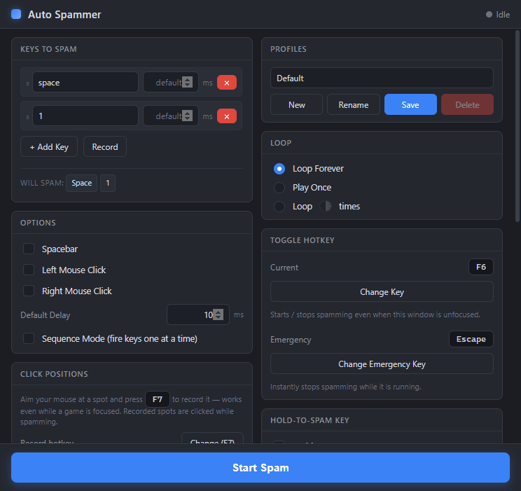

# 🎯 Auto Spammer

A simple, dark-themed **auto key-presser / clicker** for Windows. Pick the keys
you want repeated, choose how fast, and press **Start** — Auto Spammer presses
them for you. Great for games and apps that involve a lot of repeated tapping.

[](https://github.com/Scarmonit/AutoSpammer/releases/latest)
&nbsp;
[](https://github.com/Scarmonit/AutoSpammer/releases)
&nbsp;

&nbsp;
[](LICENSE)



---

## ⬇️ Download (no setup or tools needed)

Pick **one** — both are a single file you just run:

### ▶️ Option 1 — Portable (easiest: just run it)
**[⬇️ Download AutoSpammer-Portable-1.3.1.exe](https://github.com/Scarmonit/AutoSpammer/releases/latest/download/AutoSpammer-Portable-1.3.1.exe)**
→ double-click it and the app opens **immediately**. Nothing to install.

### 💾 Option 2 — Installer (adds Desktop + Start-menu shortcuts)
**[⬇️ Download AutoSpammer-Setup-1.3.1.exe](https://github.com/Scarmonit/AutoSpammer/releases/latest/download/AutoSpammer-Setup-1.3.1.exe)**
→ run it, click through, and launch from your Desktop / Start menu.

> ℹ️ **First launch:** Windows may show a blue **"Windows protected your PC"**
> box because the app isn't code-signed. Click **More info → Run anyway** — it's
> open source and every line of code is in this repo.

*(Or open the **[Latest Release page ➜](https://github.com/Scarmonit/AutoSpammer/releases/latest)**
and grab either file under **Assets**.)*

---

## 🎮 How to use it

1. **Open Auto Spammer** from the Desktop/Start-menu shortcut.
2. In **Keys to Spam** (left side), type the key you want repeated — for example
   `a`, `space`, `1`, or `f6`. Click **+ Add Key** for more, or click **Record**
   and press keys to capture them automatically.
   - The **"Will spam:"** line shows exactly what will be pressed.
3. (Optional) Set how fast under **Default Delay** — lower number = faster
   (10 ms ≈ very fast). Each key can have its own delay too.
4. **Click into the game or app** you want the keys sent to, so it's the active
   window.
5. Press the big **Start Spam** button — or tap **F6** anywhere, even while the
   game is focused.
6. To stop: press **F6** again, click **Stop Spam**, or hit **Esc** (emergency
   stop).

### 🖱️ Click Positions (record-and-click specific spots)
Want it to click exact places on screen (not just where your cursor is)?
1. In the **Click Positions** panel, aim your mouse at a spot and press **F7** —
   it records that screen location. Works even while a game is focused, so you can
   record several spots without alt-tabbing.
2. Each recorded spot shows its coordinates and an **L/R** button you can click to
   switch between left/right click. Give it its own delay, or remove it with **×**.
3. When you press **Start Spam**, Auto Spammer moves the cursor to each recorded
   spot and clicks it, in order, every cycle.

You can change the record hotkey from **F7** to anything else in that panel.

### ⌨️ Hold Keys Down
Hold any keys *down* continuously (not tapped) — e.g. hold **W** to keep walking
in a game. Add the keys in the **Hold Keys Down** panel, then toggle it with the
button or **F8**. Press again (or **Esc**) to release.

### ⏱️ Periodic Key
Press one chosen key on a timer — e.g. press **F** every 5 seconds. Set the key
and interval in the **Periodic Key** panel, then toggle with the button or **F9**.

### 🔻 System tray
Auto Spammer lives in the **system tray** so it stays out of your way while you
game. Closing the window **minimizes it to the tray** (it keeps running, and the
global hotkeys still work). Right-click the tray icon to **Show**, **Start/Stop
Spam**, **Panic Stop** everything, or **Quit**. Left-click the icon to bring the
window back.

### Handy extras
- **Spacebar / Left Click / Right Click** checkboxes — add those without typing.
- **Sequence Mode** — fire your keys one at a time per cycle instead of all at once.
- **Loop** — repeat forever, once, or a set number of times.
- **Hold-to-Spam** — pick a key; it only spams *while you physically hold it*.
- **Focus Hold** — hold a key to rapidly fire *that same key* (e.g. hold `F` to
  machine-gun `F`).
- **Profiles** — save different setups and switch between them. They're remembered
  the next time you open the app.

### ⌨️ Default hotkeys (all rebindable)
| Key | Action |
|-----|--------|
| **F6** | Start / stop spamming |
| **F7** | Record current mouse position |
| **F8** | Toggle Hold Keys Down |
| **F9** | Toggle Periodic Key |
| **Esc** | Emergency stop (stops everything, releases held keys) |

---

## ⚠️ Please use responsibly

Auto Spammer sends real key/mouse input to whatever window is focused. **Many
online/competitive games forbid input automation and may ban your account.** Only
use it where automation is allowed — single-player games, your own apps,
accessibility, testing, and the like. You're responsible for how you use it.

---

## ❓ Troubleshooting

- **"Windows protected your PC" popup** → click **More info → Run anyway**. It's
  just because the app isn't signed with a paid certificate.
- **Keys go to the wrong window** → click into the target window first; Auto
  Spammer sends to whatever is focused.
- **It won't stop** → press **Esc**, or **F6**, or click **Stop Spam**.
- **Antivirus flags it** → key-pressers look like automation tools to antivirus,
  so false positives happen. The full source is in this repo if you want to build
  it yourself (below).

---

## 🛠️ For developers (build from source — optional)

Only needed if you want to modify the app or build the installer yourself.

**Requirements:** [Node.js](https://nodejs.org/) 18+ (built on Node 24), Windows
10/11. No Visual Studio needed — the native modules ship prebuilt binaries.

```bash
git clone https://github.com/Scarmonit/AutoSpammer.git
cd AutoSpammer
npm install          # download dependencies

npm run dev          # run the app in development (hot reload)
npm run build:win    # build the installer -> release/AutoSpammer-Setup-<version>.exe
```

### Testing

Automated tests follow Electron's
[testing guidance](https://www.electronjs.org/docs/latest/tutorial/automated-testing):

```bash
npm run typecheck    # TypeScript, no emit
npm test             # Vitest unit tests (engine logic, keymap, defaults)
npm run test:e2e     # builds, then Playwright drives the real Electron app
npm run test:all     # typecheck + unit + e2e
```

- **Unit tests** (`tests/unit/`, Vitest) cover the pure logic — the spam engine
  (loop modes, sequence mode, options/positions/text, focus-hold) with the native
  input layer mocked, plus the key-name mappings and default data.
- **End-to-end tests** (`tests/e2e/`, Playwright) launch the built app via
  `_electron.launch` and assert the UI, IPC, and persistence wiring.
- CI runs all of the above on every push (`.github/workflows/test.yml`), using
  `xvfb` so the Electron window runs headless on Linux.

### Debugging

`.vscode/launch.json` includes ready-to-use configs (see Electron's
[debugging docs](https://www.electronjs.org/docs/latest/tutorial/application-debugging)):

- **Debug Main Process** — builds, then launches Electron under the Node debugger.
- **Debug Unit Tests (Vitest)** — run/break in the unit tests.
- For the **renderer**, open DevTools in the running app (`Ctrl+Shift+I`).

### Tech & layout
Electron + React + TypeScript (via `electron-vite`).

```
src/
  shared/    types, IPC channel names, default profile
  main/      Electron main process: window, IPC, input validation
    engine.ts      cancellable spam loop (runs off the UI thread)
    hotkeys.ts     global hotkeys + uiohook (record / hold detection)
    input.ts       nut-js input simulation + synthetic-event accounting
    keymap.ts      logical key name <-> nut-js / uiohook codes
    persistence.ts profiles saved as JSON in %APPDATA%\auto-spammer
  preload/   secure contextBridge (window.api)
  renderer/  React UI (one component per panel)
```

- **Input simulation:** [`@nut-tree-fork/nut-js`](https://github.com/nut-tree/nut.js)
- **Global input listening:** [`uiohook-napi`](https://github.com/SnosMe/uiohook-napi)
- **Global hotkeys:** Electron `globalShortcut`

### Security hardening
Follows the Electron security checklist (and was audited with
[Electronegativity](https://github.com/doyensec/electronegativity)):

- `contextIsolation: true`, `nodeIntegration: false`, **`sandbox: true`**, and a
  typed `contextBridge` preload — the renderer gets no Node/Electron access
  beyond the small `window.api` surface.
- Strict renderer CSP (`script-src 'self'`).
- `setWindowOpenHandler` denies in-app windows and only `shell.openExternal`s
  http/https URLs; `will-navigate` is blocked; all permission requests are denied.
- **[Electron Fuses](https://www.electronjs.org/docs/latest/tutorial/fuses)**
  flipped at package time (`build/afterPack.cjs`): `RunAsNode` off,
  `EnableNodeOptionsEnvironmentVariable` off, `EnableNodeCliInspectArguments`
  off, `EnableCookieEncryption` on, `OnlyLoadAppFromAsar` on — so the shipped
  binary can't be repurposed as a generic Node runtime or have debug flags
  injected.
- Native modules are unpacked from the asar (`asarUnpack`) so their `.node`
  binaries load correctly.

### How hold detection stays reliable
A physically held key produces auto-repeat key-*downs* but no key-*up* until you
release it. The app records every synthetic key-up it emits and matches them off
as the global hook reports them, so an *unaccounted* key-up is unambiguously your
real release. This is what makes Hold-to-Spam and Focus Hold stop reliably even
while spamming the same key.

## License

MIT — see [LICENSE](LICENSE).
