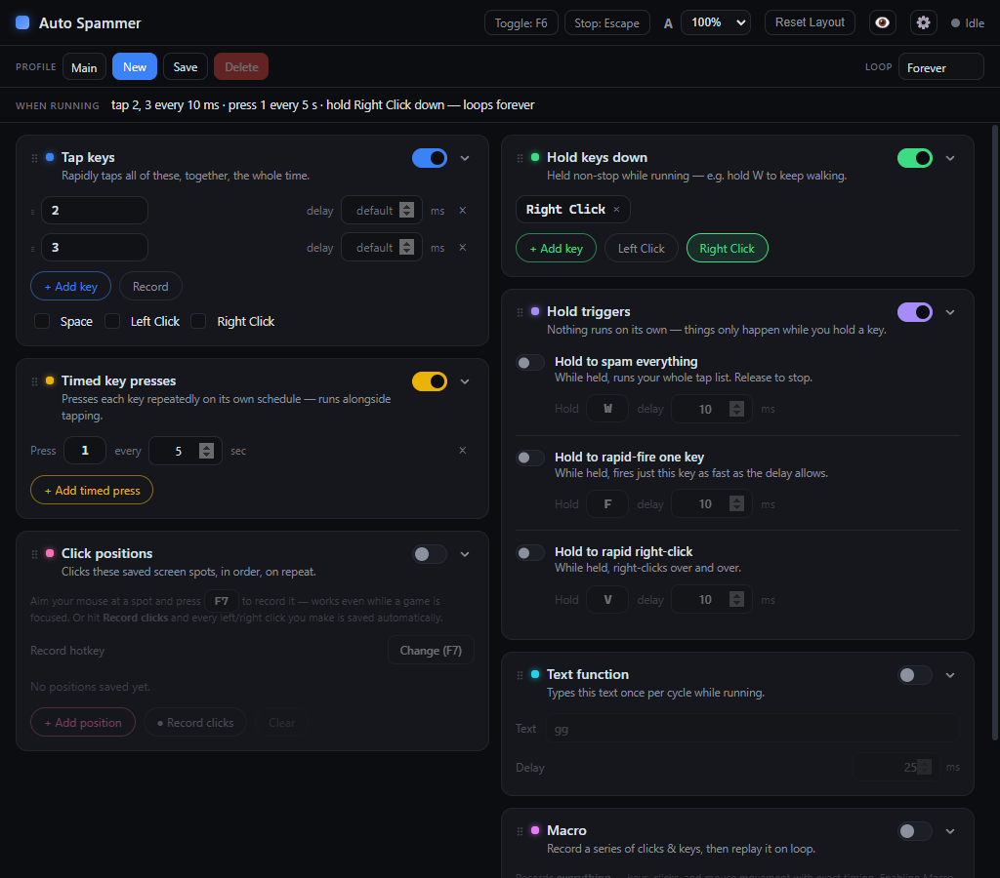
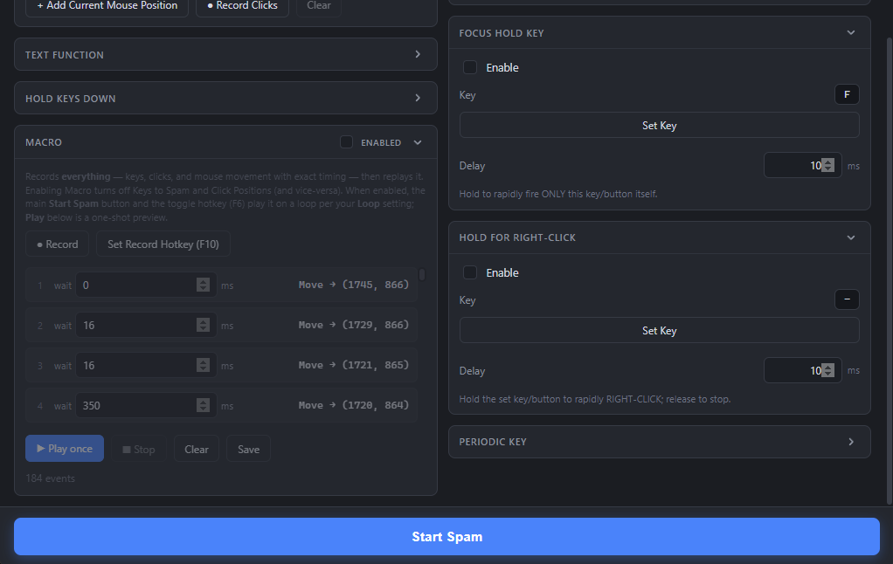

<p align="center">
  
</p>

<h1 align="center">Auto Spammer</h1>

<p align="center">
  A fast, dark-themed <strong>auto key-presser, clicker &amp; macro recorder</strong> for Windows.<br/>
  Pick what to repeat and how fast, then press <strong>Start</strong> — or record a full
  keyboard&nbsp;+&nbsp;mouse macro and play it back on a loop.
</p>

<p align="center">
  <a href="https://github.com/Scarmonit/AutoSpammer/releases/latest"></a>
  &nbsp;
  <a href="https://github.com/Scarmonit/AutoSpammer/releases"></a>
  &nbsp;
  
  &nbsp;
  <a href="LICENSE"></a>
</p>

<p align="center">
  
</p>

---

## ✨ Features

**Latest additions**

- 🎬 **Full Macro recording &amp; playback** — capture *everything* (keys, clicks, and
  mouse movement) with the exact timing between events, edit any delay, then replay it
  on a loop via **Start Spam** / **F6**.
- ↕️ **Resizable sections** — drag the splitter between any two panels to resize them;
  double-click to reset. Layout is saved per profile.
- 👁️ **Click to hide / show sections** — collapse any panel to just its title bar with
  the header chevron; remembered per profile.
- 🔀 **Independent enabling** of **Keys to Spam**, **Click Positions**, and **Macro** —
  each has its own *Enabled* switch (Macro is mutually exclusive with the other two).
- 🖱️ **Mouse buttons everywhere** — every "Set Key" / "Change Key" binds a keyboard key
  **or** a mouse button (LMB, RMB, MMB, MB4, MB5). Click the field, then press a key or
  a mouse button.
- 🔒 **Hotkey conflict prevention** — a key or mouse button can only drive one action;
  duplicate bindings are rejected with a clear message at the top of the window.
- 🔴 **Improved Record** — record keys *and* mouse clicks straight into your lists;
  clicks on the Auto Spammer window (and the key used to stop) are never captured.

**Core**

- ⌨️ **Spam any keys** — letters, digits, function keys, punctuation, numpad — each with
  its own delay, in parallel or one-at-a-time **Sequence Mode**.
- 🖱️ **Click positions** — move to and click exact screen spots (left/right) every cycle.
- 🔁 **Loop** forever, once, or a set number of times.
- ✊ **Hold-to-Spam**, **Focus Hold**, and **Hold for Right-Click** — spam only while you
  physically hold a chosen key/button.
- ⬇️ **Hold Keys Down** and ⏱️ **Periodic Key** for walk-keys and timed presses.
- 🗂️ **Profiles** — save and switch between different setups; everything is remembered.
- 🎯 **Global hotkeys** that work even while a game is focused, plus an **Esc** panic stop.
- 🔻 **System tray** — runs in the background with close-to-tray.
- 🛡️ Hardened Electron build (sandbox, context isolation, fuses) — open source, no telemetry.

---

## 📸 Screenshots

<table>
  <tr>
    <td width="50%" valign="top">
      <br/>
      <sub><b>Main window</b> — Keys to Spam with live “Will spam” preview, Options,
      Click Positions, Profiles, Loop, and rebindable hotkeys.</sub>
    </td>
    <td width="50%" valign="top">
      <br/>
      <sub><b>Macro + triggers</b> — full recording with editable per-event delays and a
      live event list, alongside Focus Hold and Hold-for-Right-Click.</sub>
    </td>
  </tr>
</table>

---

## ⬇️ Download (no setup or tools needed)

Pick **one** — both are a single file you just run:

### ▶️ Option 1 — Portable (easiest: just run it)
**[⬇️ Download AutoSpammer-Portable-1.16.0.exe](https://github.com/Scarmonit/AutoSpammer/releases/latest/download/AutoSpammer-Portable-1.16.0.exe)**
→ double-click it and the app opens **immediately**. Nothing to install.

### 💾 Option 2 — Installer (adds Desktop + Start-menu shortcuts)
**[⬇️ Download AutoSpammer-Setup-1.16.0.exe](https://github.com/Scarmonit/AutoSpammer/releases/latest/download/AutoSpammer-Setup-1.16.0.exe)**
→ run it, click through, and launch from your Desktop / Start menu.

> ℹ️ **First launch:** Windows may show a blue **"Windows protected your PC"**
> box because the app isn't code-signed. Click **More info → Run anyway** — it's
> open source and every line of code is in this repo.

*(Or open the **[Latest Release page ➜](https://github.com/Scarmonit/AutoSpammer/releases/latest)**
and grab either file under **Assets**.)*

---

## 🎮 How to use it

1. **Open Auto Spammer** from the Desktop/Start-menu shortcut.
2. In **Keys to Spam** (left side), type the key you want repeated — any key works,
   e.g. `a`, `space`, `1`, `f6`, `-`, `=`, `/`, or `numpad5`. Click **+ Add Key**
   for more, or click **Record** and press keys to capture them automatically.
   While recording, focus the game/app you're capturing for — keys and clicks
   inside the Auto Spammer window (like the Stop button) are ignored.
   - The **"Will spam:"** line shows exactly what will be pressed.
3. (Optional) Set how fast under **Default Delay** — lower number = faster
   (10 ms ≈ very fast). Each key can have its own delay too.
4. **Click into the game or app** you want the keys sent to, so it's the active
   window.
5. Press the big **Start Spam** button — or tap **F6** anywhere, even while the
   game is focused.
6. To stop: press **F6** again, click **Stop Spam**, or hit **Esc** (emergency
   stop).

### 🔀 Enable / disable Keys and Click Positions independently
Each of the **Keys to Spam** and **Click Positions** sections has its own
**Enabled** switch in the section header, so you can choose what a run actually does
*without deleting anything*:

- **Keys to Spam → Enabled** controls the key list (plus the Spacebar / Left Click /
  Right Click options).
- **Click Positions → Enabled** controls the recorded click spots.

So you can:
- Spam **only keys** — turn Keys on, Click Positions off.
- Spam **only click positions** — turn Keys off, Click Positions on.
- Spam **both** — leave both on (the default).
- If you turn **both off**, Start Spam does nothing and shows a quick warning telling
  you to enable at least one.

A disabled section greys out and is skipped, but everything you added stays saved.
These switches are stored **per profile**, so different profiles can do different
things.

### 🖱️ Click Positions (record-and-click specific spots)
Want it to click exact places on screen (not just where your cursor is)? There are
three ways to add spots:
1. **One at a time** — aim your mouse at a spot and press **F7** (or click
   **+ Add Current Mouse Position**). It records that screen location. Works even
   while a game is focused, so you can record several spots without alt-tabbing.
2. **Record Clicks (capture as you go)** — click **● Record Clicks**. The button
   turns red and pulses; now *every* left or right click you make anywhere on screen
   is saved automatically as a new position, with the correct mouse button. This also
   works while a game is focused (global mouse hook). Click **■ Stop Recording** when
   you're done — clicks on the Auto Spammer window itself (including the Stop button)
   are ignored, so only your in-game clicks get recorded.
3. Each recorded spot shows its coordinates and an **L/R** button you can click to
   switch between left/right click. Give it its own delay, or remove it with **×**.

When you press **Start Spam**, Auto Spammer moves the cursor to each recorded spot
and clicks it, in order, every cycle.

You can change the single-spot record hotkey from **F7** to anything else in that panel.

### ⌨️ Hold Keys Down
Hold keys **or mouse buttons** *down* continuously (not tapped) — e.g. hold **W** to
keep walking, or hold **Left Click**. Use **+ Add Key** to type a keyboard key, or
**+ Left Click** / **+ Right Click** to add a mouse button (shown as a chip). With the
section's **Enabled** switch on, they're held automatically whenever you press
**Start Spam** / **F6** (right alongside Keys to Spam or a Macro) and released when you
stop. You can also hold them **standalone**, without spamming, using the panel's
**Hold** button or **F8** (press again, or **Esc**, to release).

### ⏱️ Periodic Key
Press **any number of keys or mouse buttons** on their **own independent timers** —
e.g. **F** every 5 s *and* **MB4** every 2 s. Use **+ Add Periodic Key** to add a row,
**Set Key** to bind a key/mouse button, and set its own *every X seconds*. With the
section's **Enabled** switch on, all entries run automatically alongside **Start Spam**
/ **F6** (together with Keys to Spam and Hold Keys Down) and stop when you stop. You can
also run them **standalone** with the panel button or **F9**.

### 🖱️ Hold for Right-Click
Want to **auto right-click while holding a button**? In the **Hold for Right-Click**
panel, enable it and **Set Key** to any keyboard key or mouse button. While you
physically hold that trigger, Auto Spammer rapidly **right-clicks**; release to
stop. (Set the speed with its delay field.) Handy for games where you spam
right-click while a key is held.

### 🎬 Macro (full keyboard + mouse recording)
The **Macro** section records *everything* — every keystroke, every mouse click, and
the mouse path — with the exact timing between each event, then plays it all back.

1. (Optional) Click **Set Record Hotkey** to choose a key (default **F10**) that
   starts/stops recording from anywhere — even while a game is focused.
2. Click **● Record** (or press the hotkey), do your thing, then press the hotkey
   again (or **■ Stop Recording**). The key you press to stop is **never** included
   in the recording, and clicks on the Auto Spammer window itself are ignored.
3. The captured events are listed with the **delay before each one**. Edit any
   delay to speed a step up or slow it down (e.g. change `1000` ms to `250`).
4. **Run it like any other spam:** flip the section's **Enabled** switch, then press
   the big **Start Spam** button (now labelled **Start Macro**) or the toggle hotkey
   **F6** — the macro plays back with your exact timings and **repeats according to
   the Loop panel** (forever, once, or X times). **Stop Spam** / F6 stops it.
5. The panel's **▶ Play once** button is a quick one-shot preview; **■ Stop** cancels
   it, **Clear** wipes the recording, and **Save** writes it to the current profile.

Macro is **mutually exclusive** with Keys to Spam and Click Positions: enabling Macro
turns those two off, and turning either of them back on turns Macro off. The whole
recording is saved with the profile, so it's there next time you open the app.

> 💡 Pick a record hotkey you don't otherwise use in your game (F10 by default) —
> it's detected globally, so it also reaches the focused app.

### 🔻 System tray
Auto Spammer lives in the **system tray** so it stays out of your way while you
game. Closing the window **minimizes it to the tray** (it keeps running, and the
global hotkeys still work). Right-click the tray icon to **Show**, **Start/Stop
Spam**, **Panic Stop** everything, or **Quit**. Left-click the icon to bring the
window back.

### ↕️ Resizable sections
Every section is resizable. Hover the thin gap between two sections — the cursor
becomes a ↕ and a subtle line lights up — then drag up or down to make the section
above it taller or shorter. **Double-click** the splitter to snap that section back
to its natural size. Your layout is saved with the current profile, so each profile
remembers its own section sizes.

### 👁️ Hide / show sections
Don't use a section? Click the small **chevron** (˅) in its header to collapse it to
just the title bar; click again to bring it back. Every section can be hidden this
way, and which ones are collapsed is saved **per profile**, so the app reopens with
exactly the layout you left.

### Handy extras
- **Spacebar / Left Click / Right Click** checkboxes — add those without typing.
- **Sequence Mode** — fire your keys one at a time per cycle instead of all at once.
- **Loop** — repeat forever, once, or a set number of times.
- **Hold-to-Spam** — pick a key; while you physically hold it, it runs the **whole
  spam system** (every enabled section — Keys to Spam, Click Positions, Hold Keys
  Down, Periodic Key, Macro) just like Start Spam, and stops the moment you release.
- **Focus Hold** — hold a key to rapidly fire *that same key* (e.g. hold `F` to
  machine-gun `F`).
- **Profiles** — save different setups and switch between them. They're remembered
  the next time you open the app.

### ⌨️ Default hotkeys (all rebindable)
| Key | Action |
|-----|--------|
| **F6** | Start / stop spamming |
| **F7** | Record current mouse position |
| **F8** | Toggle Hold Keys Down |
| **F9** | Toggle Periodic Key |
| **F10** | Start / stop macro recording |
| **Esc** | Emergency stop (stops everything, releases held keys) |

> 🔒 **No double-binding:** every hotkey and hold-trigger key shares one pool, so a
> key (or mouse button) can only drive one action. If you try to assign a key that's
> already in use, the change is rejected and a red banner appears at the top —
> e.g. *"The key F is already bound to Focus Hold Key"*. Keyboard keys **and** mouse
> buttons are both checked.

---

## ⚠️ Please use responsibly

Auto Spammer sends real key/mouse input to whatever window is focused. **Many
online/competitive games forbid input automation and may ban your account.** Only
use it where automation is allowed — single-player games, your own apps,
accessibility, testing, and the like. You're responsible for how you use it.

---

## ❓ Troubleshooting

- **"Windows protected your PC" popup** → click **More info → Run anyway**. It's
  just because the app isn't signed with a paid certificate.
- **Keys go to the wrong window** → click into the target window first; Auto
  Spammer sends to whatever is focused.
- **It won't stop** → press **Esc**, or **F6**, or click **Stop Spam**.
- **Antivirus flags it** → key-pressers look like automation tools to antivirus,
  so false positives happen. The full source is in this repo if you want to build
  it yourself (below).

---

## 🛠️ For developers (build from source — optional)

Only needed if you want to modify the app or build the installer yourself.

**Requirements:** [Node.js](https://nodejs.org/) 18+ (built on Node 24), Windows
10/11. No Visual Studio needed — the native modules ship prebuilt binaries.

```bash
git clone https://github.com/Scarmonit/AutoSpammer.git
cd AutoSpammer
npm install          # download dependencies

npm run dev          # run the app in development (hot reload)
npm run build:win    # build the installer -> release/AutoSpammer-Setup-<version>.exe
npm run icons        # regenerate icons from build/icon-source.png
```

### Testing

Automated tests follow Electron's
[testing guidance](https://www.electronjs.org/docs/latest/tutorial/automated-testing):

```bash
npm run typecheck    # TypeScript, no emit
npm test             # Vitest unit tests (engine, macro, bindings, keymap, defaults)
npm run test:e2e     # builds, then Playwright drives the real Electron app
npm run test:all     # typecheck + unit + e2e
```

- **Unit tests** (`tests/unit/`, Vitest) cover the pure logic — the spam engine
  (loop modes, sequence mode, options/positions/text, focus-hold, **macro playback**),
  the **macro recorder/player**, **binding-conflict** detection, the key-name
  mappings, the rounded-icon geometry, and the default data — all with the native
  input layer mocked.
- **End-to-end tests** (`tests/e2e/`, Playwright) launch the built app via
  `_electron.launch` and assert the UI, IPC, and persistence wiring.
- CI runs all of the above on every push (`.github/workflows/test.yml`), using
  `xvfb` so the Electron window runs headless on Linux.

### Debugging

`.vscode/launch.json` includes ready-to-use configs (see Electron's
[debugging docs](https://www.electronjs.org/docs/latest/tutorial/application-debugging)):

- **Debug Main Process** — builds, then launches Electron under the Node debugger.
- **Debug Unit Tests (Vitest)** — run/break in the unit tests.
- For the **renderer**, open DevTools in the running app (`Ctrl+Shift+I`).

### Tech & layout
Electron + React + TypeScript (via `electron-vite`).

```
src/
  shared/    types, IPC channel names, default profile, binding-conflict rules
  main/      Electron main process: window, IPC, input validation
    engine.ts      cancellable spam + macro loop (runs off the UI thread)
    macro.ts       macro recorder + player (timing, exclusions, playback)
    hotkeys.ts     global hotkeys + uiohook (record / hold detection)
    input.ts       nut-js input simulation + synthetic-event accounting
    keymap.ts      logical key name <-> nut-js / uiohook codes
    persistence.ts profiles saved as JSON in %APPDATA%\auto-spammer
  preload/   secure contextBridge (window.api)
  renderer/  React UI (one component per panel, resizable + collapsible sections)
```

- **Input simulation:** [`@nut-tree-fork/nut-js`](https://github.com/nut-tree/nut.js)
- **Global input listening:** [`uiohook-napi`](https://github.com/SnosMe/uiohook-napi)
- **Global hotkeys:** Electron `globalShortcut`

### Security hardening
Follows the Electron security checklist (and was audited with
[Electronegativity](https://github.com/doyensec/electronegativity)):

- `contextIsolation: true`, `nodeIntegration: false`, **`sandbox: true`**, and a
  typed `contextBridge` preload — the renderer gets no Node/Electron access
  beyond the small `window.api` surface.
- Strict renderer CSP (`script-src 'self'`).
- `setWindowOpenHandler` denies in-app windows and only `shell.openExternal`s
  http/https URLs; `will-navigate` is blocked; all permission requests are denied.
- **[Electron Fuses](https://www.electronjs.org/docs/latest/tutorial/fuses)**
  flipped at package time (`build/afterPack.cjs`): `RunAsNode` off,
  `EnableNodeOptionsEnvironmentVariable` off, `EnableNodeCliInspectArguments`
  off, `EnableCookieEncryption` on, `OnlyLoadAppFromAsar` on — so the shipped
  binary can't be repurposed as a generic Node runtime or have debug flags
  injected.
- Native modules are unpacked from the asar (`asarUnpack`) so their `.node`
  binaries load correctly.

### How hold detection stays reliable
A physically held key produces auto-repeat key-*downs* but no key-*up* until you
release it. The app records every synthetic key-up it emits and matches them off
as the global hook reports them, so an *unaccounted* key-up is unambiguously your
real release. This is what makes Hold-to-Spam and Focus Hold stop reliably even
while spamming the same key.

## 🎨 Branding / icon


Auto Spammer ships with a custom app icon — a click cursor inside a blue arc on a
dark rounded panel. The artwork lives in [`build/icon-source.png`](build/icon-source.png);
`npm run icons` regenerates every derived size from it (no image tools required):

- **`build/icon.ico`** (16–256 px) — used for the Windows **.exe**, the **installer**,
  and the window **title bar** (via electron-builder's `win.icon` / `nsis.installerIcon`).
- **`build/icon.png`** (512 px) and **`docs/icon.png`** (256 px, this README's logo).
- The **system-tray** + window icons are embedded as data URLs in
  `src/main/trayicon.ts`, so they render crisply with no runtime path concerns.

> 🖼️ **Maintainer tip:** to set this as the repository avatar on GitHub, open
> **Settings → General**, scroll to the repo image / social-preview area, and upload
> `docs/icon.png` (GitHub repos don't have a true "avatar", but the owner's profile
> picture and the **Social preview** image both accept this file).

## License

MIT — see [LICENSE](LICENSE).
